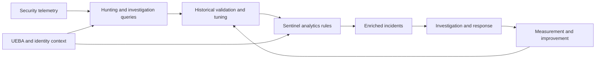

# KQL Templates

A professional, practical KQL reference library for Microsoft Sentinel, Microsoft Defender XDR, Microsoft Entra ID, Microsoft Purview, Azure, Microsoft 365, and AI Security detection engineering.

The repository separates exploratory hunting, analyst investigation, and deployable detection content. Each production-oriented query documents its data requirements, entity fields, false positives, tuning guidance, and validation status.

## Detection Engineering Architecture



This repository is designed for security engineers, SOC analysts, detection engineers, incident responders, threat hunters, and architects who want to learn, write, tune, and operationalize KQL queries.

## What This Repository Provides

- Beginner-friendly KQL learning path
- Real-world Microsoft Sentinel and Defender query templates
- Detection engineering patterns
- Threat hunting examples
- Investigation queries
- Microsoft Purview data security queries
- AI Security and Agentic AI detections
- UEBA queries using `BehaviorAnalytics` and `IdentityInfo`
- Deployable Microsoft Sentinel scheduled analytics rules
- Detection architecture and lifecycle diagrams
- Repository validation for query metadata and rule structure
- ASIM-normalized query examples
- Self-contained KQL logic fixtures
- Custom AI telemetry schema contracts
- Query tuning and performance guidance
- Reusable query templates
- Sentinel analytics rule examples
- Analyst-focused explanations for each query

## Who This Is For

| Role | How to Use This Repo |
|---|---|
| SOC Analyst | Run triage and investigation queries during alerts and incidents |
| Detection Engineer | Convert hunting logic into Sentinel analytics rules |
| Incident Responder | Scope users, hosts, IPs, files, and cloud activity |
| Security Architect | Understand telemetry requirements and detection coverage |
| KQL Beginner | Learn query patterns with explained examples |

## Repository Structure

```text
.
├── docs/
│   ├── fundamentals/
│   ├── reference/
│   └── use-cases/
├── templates/
├── queries/
│   ├── identity/
│   ├── endpoint/
│   ├── network/
│   ├── cloud/
│   ├── email/
│   ├── ai-security/
│   ├── ueba/
│   ├── asim/
│   ├── purview/
│   └── sentinel-operations/
├── analytics-rules/
├── workbooks/
├── docs/architecture/
├── docs/schemas/
├── tests/fixtures/
└── scripts/validate_content.py
```

## Content Types

| Content | Purpose | Production readiness |
|---|---|---|
| `queries/` | Hunting, investigation, and detection logic | Check each file's `Validation Status` |
| `queries/ueba/` | Behavior and identity-enriched analytics | Requires Sentinel UEBA |
| `analytics-rules/` | Scheduled Microsoft Sentinel rule YAML | Tune and validate before deployment |
| `templates/` | Starting points for new content | Replace every placeholder |
| `docs/architecture/` | Detection engineering operating models | Reference documentation |
| `docs/schemas/` | Contracts for repository-defined custom telemetry | Required for custom tables |
| `tests/fixtures/` | Self-contained `datatable()` logic checks | Complements workspace testing |

Browse the generated [content catalog](docs/content-catalog.md) for query type, tables, severity, validation status, ATT&CK mappings, and rule versions.

See the [validation strategy](docs/validation-strategy.md) for the distinction between static checks, logic fixtures, schema compilation, Sentinel smoke tests, and production validation.

## Validate the Repository

```bash
python3 scripts/validate_content.py
python3 scripts/generate_catalog.py --check
```

Install development dependencies with `python3 -m pip install -r requirements-dev.txt`. The validator checks query metadata, rule identifiers, `TimeGenerated`, scheduling, unresolved placeholders, final entity and custom-detail output columns, alert placeholders, fixtures, relative Markdown links, and YAML structure.

## Recommended Learning Path

1. Start with `docs/fundamentals/01-kql-basics.md`
2. Review `docs/fundamentals/02-common-operators.md`
3. Use `templates/query-template.kql`
4. Practice with `queries/identity/failed-logons-by-user.kql`
5. Learn joins with `docs/fundamentals/03-joins-and-correlation.md`
6. Convert hunting logic into analytics rules using `analytics-rules/README.md`

## Core KQL Concepts Covered

- `where`
- `project`
- `extend`
- `summarize`
- `join`
- `let`
- `parse`
- `mv-expand`
- `make_set()`
- `arg_max()`
- `bin()`
- `distinct`
- `materialize()`
- time windows
- entity mapping
- detection tuning

## Recommended Topics

Use these GitHub topics:

```text
kql
microsoft-sentinel
defender-xdr
threat-hunting
detection-engineering
incident-response
security-operations
ueba
ai-security
microsoft-purview
azure-security
entra-id
soc
siem
```

## Repository Notice

This repository is maintained as a professional cybersecurity portfolio and research project focused on detection engineering, incident response, threat hunting, security automation, and AI security.
Content is published for educational, technical, and professional reference purposes. This repository is not currently accepting unsolicited community contributions, issue submissions, or feature requests. `CONTRIBUTING.md` documents the maintainer's content-quality workflow.
All content is provided as-is and should be reviewed, tested, and validated before use in production environments.

## Disclaimer

These queries are intended for defensive security operations, threat hunting, and detection engineering. Always validate and tune thresholds before production deployment.

Unsolicited requests are not currently being accepted.
