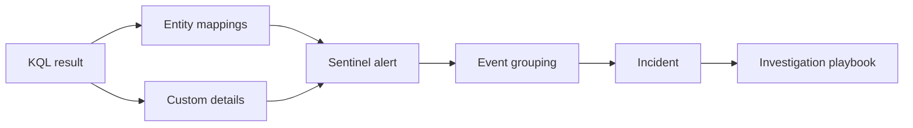

# Sentinel Analytics Rules

This folder contains deployable examples for converting validated KQL into Microsoft Sentinel scheduled analytics rules. Treat thresholds, exclusions, connector identifiers, and query periods as starting points that must be tested against the target environment.

## Rule Catalog

| Domain | Rules | Primary tables |
|---|---|---|
| Identity | Password spray; MFA fatigue followed by success; privileged role assignment | `SigninLogs`, `AuditLogs` |
| Endpoint | Suspicious PowerShell; Office spawning a shell; LOLBin network retrieval | `DeviceProcessEvents` |
| Cloud | Resource deletion; Key Vault secret-access spike; diagnostic settings deletion | `AzureActivity`, `AzureDiagnostics` |
| Purview | Mass downloads; sensitive external sharing; label downgrade | `OfficeActivity` |
| AI security | Prompt injection; sensitive output; anomalous agent tool use | `AIApp_CL`, `AIToolExecution_CL` |
| UEBA | Privileged-identity anomaly; dormant-account anomaly; service-account anomaly | `BehaviorAnalytics`, `IdentityInfo` |

Each domain now includes three examples. The custom AI and Purview label rules deliberately document schema assumptions; confirm their fields against the target workspace before deployment.

## Query-to-Incident Flow

## Analyst Query vs Analytics Rule

An analyst query helps with investigation. An analytics rule should be:

- precise
- tuned
- mapped to entities
- mapped to MITRE ATT&CK
- assigned a severity
- documented with false positives
- supported by response guidance

## Recommended Rule Lifecycle

1. Write a hunting query.
2. Validate results for 7-30 days.
3. Identify false positives.
4. Add allowlists or threshold tuning.
5. Add entity mapping.
6. Convert to analytics rule.
7. Create incident response guidance.
8. Review after deployment.

## Deployment Checklist

- Confirm every required connector and table is populated.
- Run the query across at least 7–30 days of representative data.
- Replace generic thresholds with environment baselines.
- Verify every entity mapping column is present in the final query output.
- Confirm ATT&CK mappings describe the detected behavior, not merely the data source.
- Review alert grouping, incident grouping, suppression, and lookback overlap.
- Test positive, negative, and expected-benign cases before enabling incidents.
- Record the validation date and evidence in the pull request or release notes.
