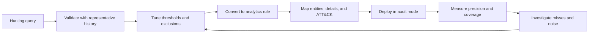

# Detection Engineering Lifecycle

Use this lifecycle to move a KQL idea from exploration to an observable, maintainable production detection.

## Promotion gates

| Gate | Required evidence |
|---|---|
| Hunting → candidate | The behavior is security-relevant and observable in available telemetry |
| Candidate → rule | Positive and expected-benign cases have been tested |
| Rule → enabled | Entities, incident grouping, lookback overlap, and response ownership are verified |
| Enabled → mature | Precision, alert volume, investigation value, and known coverage gaps are measured |

Detection content should be versioned when logic, thresholds, mapped entities, or required data changes. Cosmetic documentation changes do not require a rule version increase.
