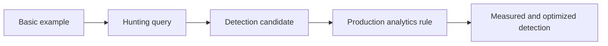

# Query Maturity Model

| Level | Expected characteristics |
|---|---|
| Basic example | Demonstrates syntax or a single behavior; clearly labeled `Example` |
| Hunting query | Explains the hypothesis and provides broad analyst context |
| Detection candidate | Defines thresholds, entities, false positives, and response guidance |
| Production analytics rule | Has deployable YAML, verified mappings, grouping, and test evidence |
| Measured detection | Tracks precision, volume, coverage, tuning decisions, and review dates |

## Validation labels

- **Example** — structurally reviewed but not executed against representative telemetry.
- **Lab Tested** — executed with controlled positive and negative cases.
- **Production Validated** — operated in a representative environment with documented results.

Do not infer validation from query complexity. A short query with good test evidence is more mature than an elaborate query with unverified assumptions.
