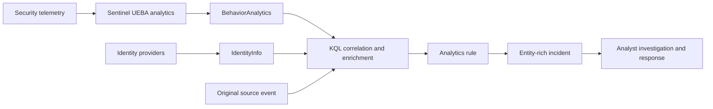

# UEBA Enrichment Flow

Microsoft Sentinel UEBA adds behavioral context to raw activity. The most useful detections combine an anomalous activity record with current identity context and the original source event.

## Design principles

- Treat `InvestigationPriority` as context, not a verdict.
- Use the latest relevant `IdentityInfo` record per identity.
- Raise confidence by correlating anomalies with sensitive roles, risky actions, or another telemetry plane.
- Project the anomaly reason and supporting insights into the alert.
- Document identity-field assumptions because schemas can vary across sources and environments.
- Keep a lower-threshold hunting version and a more selective analytics-rule version.
